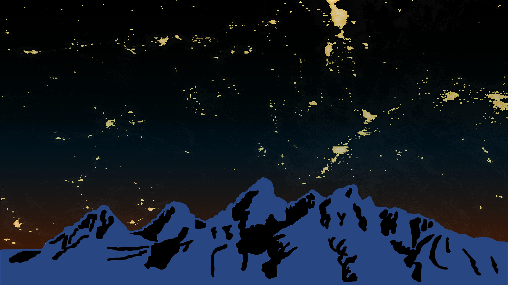

.. Skyglow documentation master file, created by
   sphinx-quickstart on Fri Jun 30 20:51:36 2017.
   You can adapt this file completely to your liking, but it should at least
   contain the root `toctree` directive.

==============================
**Skyglow Estimation Toolbox**
==============================

*Current Version: v0.0.1*

   *Summer 2017 Wyoming Cross-Cutting II Team Website Image. Teton Range, WY displayed below a processed artificial skyglow map around Grand Teton National Park, generated from a nine-month composite image.*

Skyglow is the brightening of the sky caused by various illuminated sources, including anthropogenic lighting, atmospheric factors, and celestial light. With the unprecedented growth of urbanization, artificial lighting has been rapidly increasing the brightness of the night sky around the world. This problem has attracted serious concerns from researchers, scientists, and communities to address the ramifications of what is now known as light pollution.

Previously the impact of light pollution on sky brightness was measured by handheld Sky Quality Meters and observations from the Defense Meteorological Satellite Program (DMSP) Operational Linescan System. Both have observational flaws: the Sky Quality Meter is limited in range and feasibility, the DMSP sensor in resolution.

To refine these measurements, the Wyoming Cross-Cutting team at the NASA DEVELOP National Program created the Skyglow Estimation Toolbox (SET) in partnership with the National Park Service and Wyoming Stargazing. The Toolbox is written in Python 2.7 and takes satellite measurements from NASA and NOAA's Suomi National Polar-orbiting Partnership (NPP) Visible Infrared Imaging Radiometer Suite (VIIRS) satellite sensor to map images of skyglow using local parameters. Researchers using the Toolbox can identify sources of light pollution with far greater precision by factoring in light scattering at different viewing angles and apply SET's propagation model to varying locations.

All the Toolbox's user and developer documentation can be found on this website. End-users can refer to the navigation bar's "Index" at the top of the page to find information on installing, running, and generating skyglow maps. Likewise, developers looking to contribute to the documentation or program can find guidelines through the index. Thank you for visiting!

.. figure:: _static/suominpp.png
   :scale: 35%
   :align: right

**Contents**
------------

.. toctree::
   :maxdepth: 2

   overview
   installation
   tutorial

.. toctree::
   :maxdepth: 2

   dev/conventions
   dev/enviroment
   dev/docs
   dev/site
   doc/modules

.. toctree::
   :maxdepth: 2

   trouble/faq
   trouble/issuetracker
   trouble/contact
