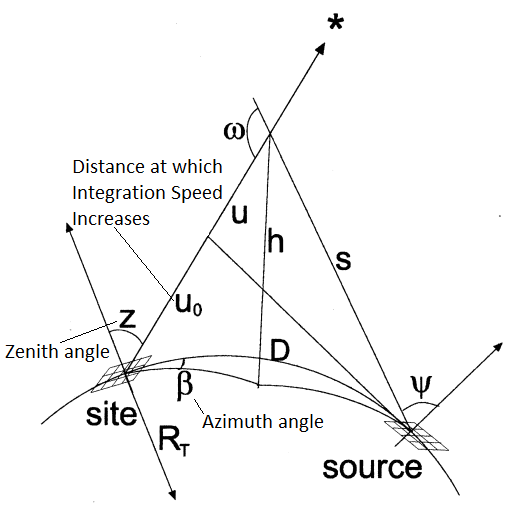

===============
**Methodology**
===============

This page gives insight into the way the computer model applies the physics and geometry of light propagation. It involves extensive applications of spherical trigonometry and programming, and it may be necessary to review key concepts. Although not necessary to operate the program, understanding the methodology offers benefits for anyone looking to improve SET or use it for academic purposes.

**Kernel Creation**
-------------------

All of SET's methods for applying its light propagation model are in the file ``Itest.py``, which executes the ``main`` function. In this function, SET first checks if a kernel is already created and, if no kernel is supplied, creates a kernel. A kernel is essentially a matrix with numerical coefficients representing the weight of light scattering from the source to the line of sight of the observer. Each pixel in the kernel thus contains a unitless value that compares the amount of light emitted from the ground to the amount of light scattered.

The kernel creation process is executed in ``main`` in lines 30-38::

    if os.path.isfile(kerneltiffpath) is False:
        # Estimate the 2d propagation function
        # bottom bottom_lat = 40.8797
        # top lat= 46.755666
        propkernel, totaltime = fsum_2d(regionlat_arg, k_am_arg, zen_arg, azimuth_arg)
        logger.debug('propagation array: %s', propkernel)
        kerneltiffpath = 'kernel_' + str(regionlat_arg) + '_' +  str(k_am_arg) + '_' + str(zen_arg) + '_' + str(azimuth_arg)
        array_to_geotiff(propkernel, kerneltiffpath, filein)
        logger.info("time for prop function ubreak 10: %s", totaltime)

The block calls ``fsum_2d``, which goes from line 109-230 and produces the array that serves as the light propagation kernel. ``fsum_2d`` begins by gathering several inputs: regional latitude, Earth radius, and the array of beta angles. By applying the `haversine formula <https://en.wikipedia.org/wiki/Haversine_formula>`_, the program then creates an array of the distances from the observation site to the light sources along an ellipsoid surface, *D*, from the latitude and Earth radius.

   *Diagram of the light propagation model created by Cinzano. Shows the relationships between the observation site and the light source. Taken and modified from REF 2, Fig. 6, p.648.*

Additionally, an array of beta angles, :math:`\beta`, is created that corresponds with the array of great circle distances. 

References:

(1) Falchi, F., P. Cinzano, D. Duriscoe, C.C.M. Kyba, C.D. Elvidge, K. Baugh, B.A. Portnov, N.A. Rybnikova and R. Furgoni, 2016. The new workd atlas of artificial night sky brightness. Sci. Adv. 2.

(2) Cinzano, P., F. Falchi, C.D. Elvidge and  K.E. Baugh, 2000. The artificial night sky brightness mapped from DMSP satellite Operational Linescan System measurements. Mon. Not. R. Astron. Soc. 318.

(3) Garstang, R.H., 1989. Night-sky brightness at observatories and sites. Pub. Astron. Soc. Pac. 101.
