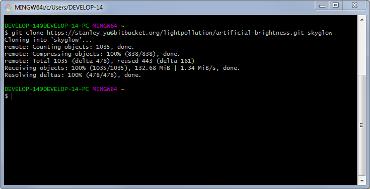

================
**Installation**
================

SET is still in its early stages of development and does not yet offer a double-click
installer. As a result, running the program requires you to setup the development environment,
which can be tricky for those not familiar with programming in the command line. We've tried to be as
descriptive as possible in our installation guide for our users. This step-by-step guide should be enough to setup the program correctly, but if you have any questions or trouble installing, feel free to ask for help from the :doc:`support page <trouble/contact>` and describe your issue to us.

**Windows**
-----------

1. Download `Anaconda - Python 2.7 version <https://www.continuum.io/downloads>`_

.. warning::

   When installing Anaconda, you must change Advanced Options to add Anaconda to your PATH. Disregard the "Not recommended" warning and check the "Add Anaconda to my PATH environment variable" option.

2. Download `Git <https://git-scm.com/downloads>`_

3. Open Anaconda Prompt and clone the SET repository by typing::
	
	git clone <SET Repository Link> skyglow

   *Example of cloning the repository from Bitbucket, a we-based hsoting service for Git similar to Github. SET's repository link can be found on its Github page, under the green "Clone or download" button. Your link will be unique to your account.*

4. Switch into skyglow and install the geospatial environment, which contains all the necessary packages::

	cd skyglow
	conda env create -f geospatial_env.yml

5. Activate the environment (must be done every time you open the prompt)::

	activate geospatial

6. Run the program::

	python Skyglow.py

**Required Packages**
----------------------

The following dependencies are needed for the program to run properly. For help with installation, check the FAQ or contact the developers on the :doc:`support page <trouble/contact>`.

* `anaconda`_
* `numpy`_ via ``conda``
* `GDAL`_
* `matplotlib`_
* `Pillow`_

This list contains all the packages contained in the geospatial environment. See above for instructions on how to install geospatial.

+--------------------------------------+--------------------------------------+
| geospatial_env.yml                                                          |
+======================================+======================================+
| - bzip2=1.0.6=vc9_3                  | - openssl=1.0.2k=vc9_0               |
| - curl=7.52.1=vc9_0                  | - pillow=3.4.2=py27_0                |
| - cycler=0.10.0=py27_0               | - pip=9.0.1=py27_1                   |
| - decorator=4.0.11=py27_0            | - proj4=4.9.2=vc9_0                  |
| - freetype=2.5.5=vc9_2               | - pyparsing=2.1.4=py27_0             |
| - functools32=3.2.3.2=py27_0         | - pyqt=5.6.0=py27_2                  |
| - gdal=2.1.0=py27_0                  | - python=2.7.13=1                    |
| - geos=3.5.0=vc9_0                   | - python-dateutil=2.6.0=py27_0       |
| - hdf5=1.8.15.1=vc9_4                | - pywavelets=0.5.2=np112py27_0       |
| - icu=57.1=vc9_0                     | - qt=5.6.2=vc9_0                     |
| - jpeg=8d=vc9_2                      | - scikit-image=0.13.0=np112py27_0    |
| - kealib=1.4.6=vc9_0                 | - scipy=0.19.0=np112py27_0           |
| - libgdal=2.1.0=vc9_0                | - setuptools=27.2.0=py27_1           |
| - libnetcdf=4.3.3.1=vc9_4            | - sip=4.18=py27_0                    |
| - libpng=1.6.27=vc9_0                | - six=1.10.0=py27_0                  |
| - libtiff=4.0.6=vc9_2                | - subprocess32=3.2.7=py27_0          |
| - matplotlib=2.0.2=np112py27_0       | - tk=8.5.18=vc9_0                    |
| - mkl=2017.0.1=0                     | - vs2008_runtime=9.00.30729.5054=0   |
| - networkx=1.11=py27_0               | - wheel=0.29.0=py27_0                |
| - numpy=1.12.1=py27_0                | - xerces-c=3.1.4=vc9_0               |
| - olefile=0.44=py27_0                | - zlib=1.2.8=vc9_3                   |
+--------------------------------------+--------------------------------------+

.. _anaconda: http://continuum.io/downloads
.. _numpy: http://www.numpy.org/
.. _gdal: http://www.gdal.org/
.. _matplotlib: https://matplotlib.org/
.. _Pillow: https://pypi.python.org/pypi/Pillow/2.7.0
